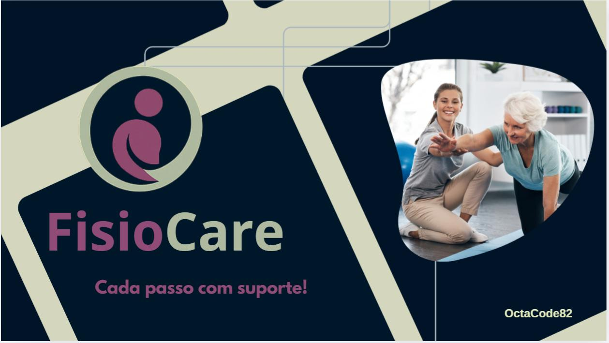

# Samuel | Portfólio

> Do interior de Minas Gerais a São Paulo, construindo uma trajetória em tecnologia por meio de formação, prática e projetos.

Este repositório reúne meu portfólio pessoal: uma apresentação da minha trajetória, das tecnologias que venho desenvolvendo e de soluções que idealizei para problemas do dia a dia. O site foi construído como uma página estática, com foco em leitura, responsividade e experiência visual.

<p align="center">
  <a href="https://github.com/Samuel-ssf/">GitHub</a> ·
  <a href="https://www.linkedin.com/in/samuel-ssf/">LinkedIn</a> ·
  <a href="./index.html">Ver portfólio</a> ·
  <a href="./curriculo.html">Ver currículo</a> ·
  <a href="./Curriculo-Samuel.pdf">Baixar currículo em PDF</a>
</p>

---

## 👨‍💻 Minha história

Cresci no interior de Minas Gerais, em um contexto que me ensinou a observar, ter paciência para resolver problemas e valorizar cada etapa do caminho. A mudança para São Paulo abriu espaço para transformar esse interesse em uma formação mais estruturada e em experiências práticas.

A base veio do curso Técnico em Informática, com lógica de programação, desenvolvimento de sistemas, manutenção e banco de dados. Depois, avancei para o Bootcamp Full Stack Java da Generation Brasil e iniciei a graduação em Engenharia de Software na Anhanguera.

Hoje trabalho na Noovi como desenvolvedor de URA/IVR, estruturando fluxos de atendimento, automações e integrações com APIs. Em paralelo, sigo construindo projetos próprios que unem desenvolvimento web, experiência do usuário e soluções úteis.

```text
🌱 Interior de Minas Gerais
        ↓
🎓 Técnico em Informática
        ↓
💻 Formação Full Stack Java e projetos independentes
        ↓
🔗 URA/IVR, automações e integrações com APIs
        ↓
🏗️ Engenharia de Software em andamento
```

## 🚀 Caminho técnico

| Frente | Tecnologias e práticas presentes na trajetória |
| --- | --- |
| Desenvolvimento web | HTML, CSS, JavaScript, TypeScript, Tailwind CSS, React e Angular |
| Back-end e integração | Java, Spring Boot, APIs REST, Swagger, URA/IVR e integração de sistemas |
| Dados | SQL e fundamentos de banco de dados |
| Ferramentas | Git, GitHub e deploy em nuvem |

O próprio portfólio usa HTML e Tailwind CSS via CDN. As demais tecnologias acima refletem formação, estudos e experiências descritas no currículo, não uma alegação de especialização em todas elas.

## 📌 Projetos apresentados

Os projetos abaixo fazem parte da seleção visual do portfólio. As descrições registram o problema que cada proposta busca resolver; como não há repositórios individuais neste projeto, não atribuo stacks ou funcionalidades além do que está documentado.

<table>
  <tr>
    <td width="33%" valign="top">
      
      <h3>Garfo & Go</h3>
      <p>Proposta de um sistema de pedidos de comida para tornar o pedido pelo celular mais rápido e prático.</p>
    </td>
    <td width="33%" valign="top">
      
      <h3>Go Lady</h3>
      <p>Sistema de caronas compartilhadas pensado para conectar mulheres motoristas e passageiras, com mais segurança e conforto nas viagens.</p>
    </td>
    <td width="33%" valign="top">
      
      <h3>Fisio Care</h3>
      <p>Proposta de apoio ao atendimento de idosos, reunindo consultas, exercícios, lembretes de medicamentos e contato com familiares ou profissionais de saúde.</p>
    </td>
  </tr>
</table>

## ✨ O que este repositório mostra

- Uma página de portfólio com apresentação pessoal, trajetória e projetos.
- Uma página de currículo e uma versão para download em PDF.
- Uso de imagens próprias para contextualizar origem, interesses e projetos.
- Design responsivo construído com HTML e Tailwind CSS.

## 🧠 Como eu penso desenvolvimento

Gosto de começar pelo contexto antes de escolher a tecnologia. Em atendimento automatizado, isso significa entender a jornada de quem liga antes de desenhar um fluxo. Em projetos web, significa pensar no caminho de quem vai usar a interface antes de adicionar elementos visuais.

Também valorizo separar o problema em partes menores, comunicar com clareza e transformar o que aprendo em algo concreto. É assim que a formação técnica, os estudos em Engenharia de Software, as integrações de APIs e os projetos independentes se conectam na minha evolução.

## 📚 Momento atual

**Aprofundando:** Java, Spring Boot, APIs REST, integrações de sistemas, desenvolvimento web e arquitetura de software.

**Aplicando no trabalho:** fluxos de URA/IVR, automações de atendimento e integração com APIs e sistemas internos.

**Construindo:** projetos que combinam interfaces responsivas, lógica de negócio e uma experiência mais direta para quem usa o produto.

## 🎯 Próximos passos

Quero consolidar a base em Engenharia de Software por meio de aplicações cada vez mais completas: com boa organização, integrações confiáveis e decisões técnicas explicadas de forma simples. A meta é evoluir a experiência atual com automação e atendimento para a construção de sistemas web que resolvam problemas reais.

## 🗂️ Como visualizar localmente

Não há dependências nem etapa de compilação. Basta abrir [index.html](./index.html) no navegador. Para consultar a trajetória detalhada, abra [curriculo.html](./curriculo.html) ou o [currículo em PDF](./Curriculo-Samuel.pdf).

---

<p align="center">
  <sub>Portfólio de Samuel — construído como registro de uma carreira em evolução.</sub>
</p>
